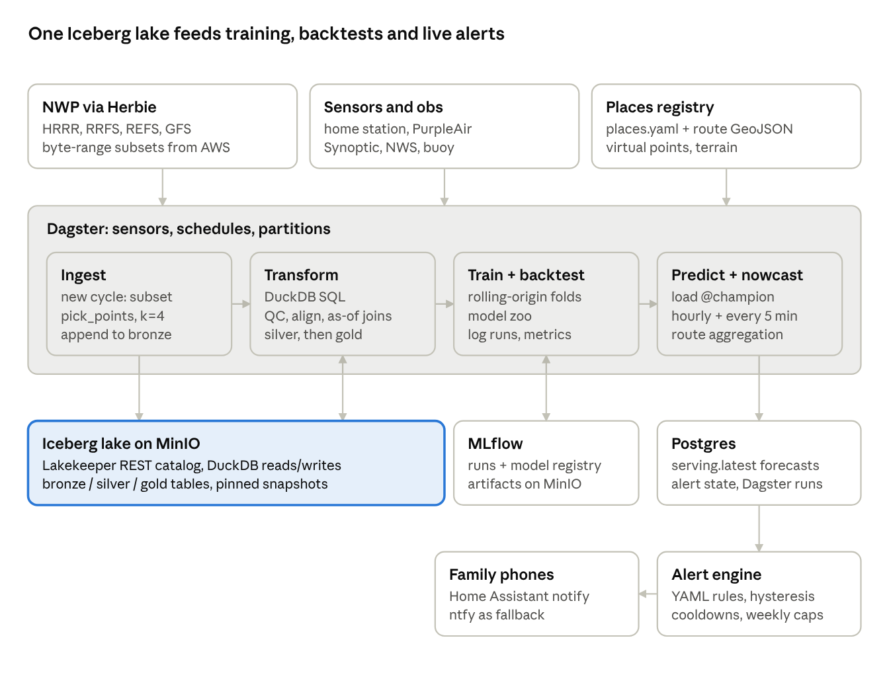
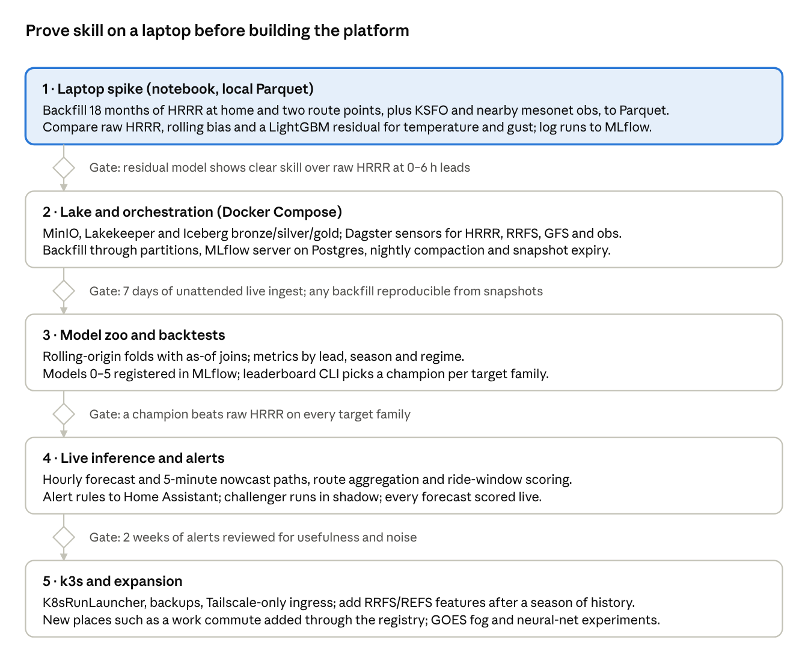

# Microcast SF — Design Doc

Oct 4, 2026 · @Lamont Lucas

> This is the original design doc, kept as written. Decisions made after it
> (storage semantics, cloud-cover target, PyIceberg-only writes, review
> findings) live in [`decisions.md`](decisions.md) and take precedence where
> they differ.

## Summary

Microcast is a Python framework that ingests hourly NWP runs (HRRR, RRFS, REFS, GFS) plus real-time neighborhood sensors, learns the local error of each model at a handful of named SF places and routes, and pushes plain-language alerts. The forecasts are the test case; the product is the platform: a repeatable path from raw data to features to competing models to backtests to live inference, with every run tracked in MLflow and every dataset queryable in DuckDB.

**Goals**

- Point forecasts for registered places and routes, refreshed within ~15 min of each new model cycle or sensor update.
- A plugin model zoo: any technique (raw NWP, bias correction, gradient boosting, nowcast blend, ensemble) is a class with `fit` / `predict`, compared head-to-head on identical backtest folds.
- Reproducible experiments: each MLflow run records the Iceberg snapshot IDs it trained on.
- Event-driven ingest that also backfills years of history with the same code path.
- Adding a place (a new commute) is a config change, not a code change.
- Runs on a laptop first, Docker Compose second, k3s third, with the same images.

**Non-goals**

- Running a physics model (WRF/MPAS) locally.
- Gridded forecasts for the whole city; we predict at registered points and along registered routes only.
- A public app. Alerts go to the family's phones.
- Severe-weather warnings. Anything safety-critical defers to the NWS.

## Use cases

Three launch use cases cover the three kinds of target the framework must support: a point, a short route, and a long route with a time window to choose.

| Use case | Target type | What we predict | Example alert |
| --- | --- | --- | --- |
| House (Castro/Market) | Point | Temp, dewpoint, wind speed/gust/direction, precip probability, PM2.5, fog/low-cloud onset | "Fog reaches the house around 5 pm; temp drops 8°F by 6 pm." |
| School walk, Divisadero corridor (~1 mi) | Route, fixed schedule | Worst-case and mean conditions along the route during the walk window | "Good chance of rain on the walk home from school today, 3:15–3:35." |
| Ocean Beach bike ride | Route, flexible departure | Headwind/crosswind component per segment, fog arrival at the coast, best departure window | "Westerlies pick up in 2 h. Leave by 1:30 for a tailwind home before 15 mph gusts." |

The weather signals that matter here are well known and learnable:

- **Marine layer / fog push.** Afternoon onshore flow pulls stratus through the Golden Gate and over Twin Peaks; timing varies by hour across neighborhoods. HRRR is often late or shallow with it.
- **Sea-breeze westerlies.** Wind ramps through the afternoon, strongest near the coast and in gaps. This sets the bike ride's return leg.
- **Offshore (easterly) events.** Mostly fall and winter; warm, dry, clear, often with smoke and PM2.5 changes.
- **Frontal rain.** Mostly Nov–Mar; timing within an hour matters for a 20-minute walk.

Alerts answer "when does it change?", not "what is the value at 3 pm?". So models predict both values and event onset times (see Inference).

## Data sources

All NWP comes through Herbie, which now ships templates for operational RRFS and REFS on the `noaa-rrfs-ops-pds` bucket. We extract only the handful of GRIB messages and grid cells we need, so storage stays in the megabytes per day.

**NWP models (via Herbie)**

| Model | Grid | Cycles | Horizon | Role here |
| --- | --- | --- | --- | --- |
| HRRR (`hrrr`, `sfc` + `subh`) | 3 km CONUS | Hourly | 18 h; 48 h at 00/06/12/18Z | Primary short-range signal; 15-min `subh` for onset timing. Archive back to 2014; use v4 (Dec 2020+) only. |
| RRFS deterministic (`rrfs`, `2dfld` / `prslev` / `subh`) | 3 km | Hourly | 18 h; 84 h at 00/06/12/18Z | Second opinion and HRRR successor. `2dfld`/`prslev` only on 3-hourly cycles; other cycles publish `subh` only. |
| RRFS members (`rrfs`, `2dfldnomads`, `member=1..5`) | 3 km, `na` domain | 00/06/12/18Z | 60 h | Cheap spread estimate at our points. |
| REFS (`refs`) | 3 km | 00/06/12/18Z | ~60 h | Ensemble mean and exceedance probabilities (rain, wind). Published as derived products, not raw members. |
| GFS (`gfs`, `0p25`) | 0.25° | 00/06/12/18Z | 384 h | Synoptic regime features (offshore-flow setup, ridge strength) and the day-2+ outlook. |

Two cautions. NWS moved RRFS/REFS operations to October 6, 2026, while Herbie's RRFS page cites October 14; verify on day one and keep the pre-operational parallel data flagged as such. RRFS history is only ~2 months deep, so it cannot be trained on alone yet (see Risks).

**Observations (ground truth and nowcast inputs)**

| Source | Cadence | Variables | Notes |
| --- | --- | --- | --- |
| Own weather station (Tempest or Ecowitt), at the house | 1 min, local push | Temp, RH, wind, gust, rain, pressure, solar | The only calibrated truth at the house. Local UDP/HTTP, no cloud dependency. |
| PurpleAir, own sensor | 2 min, local JSON | PM2.5 (both channels), temp, RH, pressure | Poll the sensor's LAN endpoint directly: free and real time. Temp reads hot; use as a trend feature only. |
| PurpleAir, nearby public sensors | 10–15 min | PM2.5, temp, RH | Points-billed API. Bounding-box query over SF, short field list, then QC. A spatial network for fog and smoke fronts. |
| Synoptic Data (MesoWest) | 5–15 min | Temp, dewpoint, wind, gust | ASOS, RAWS and CWOP near the routes; `SynopticPy` by the Herbie author. |
| NWS API (KSFO, KOAK, KHAF, buoy 46026) | Hourly / 10 min | METAR, ceiling, visibility | Ceiling and visibility label the fog events. Buoy gives SST and onshore wind. |
| GOES-18 (`goes2go`) | 5 min CONUS | Low-cloud / fog product, visible imagery | Optional, phase 3. Best fog-edge signal available. |
| NWS gridded forecast / NBM | Hourly | All | A baseline to beat, not an input. |

**Static features (computed once per place)**

- USGS 3DEP 1 m DEM: elevation, slope, aspect, sky-view factor.
- Distance to coast, and terrain height upwind along 270° (Golden Gate gap) and 090° (offshore).
- Gap exposure: is the place in line with the Golden Gate or a Twin Peaks saddle?
- Each model's own terrain height at the nearest grid cells, to correct lapse-rate bias.

## Places and routes registry

Every forecast target is declared in one YAML file; adding a work commute means adding an entry and running a backfill, with no code change. The registry is the join key for every table downstream.

```yaml
# config/places.yaml
places:
  - id: home
    kind: point
    lat: 37.76xx      # keep real coords out of git; load from .env
    lon: -122.43xx
    sensors: [tempest_home, purpleair_home]
    variables: [t2m, td2m, wind10, gust, precip, pm25, ceiling]

routes:
  - id: school_walk
    kind: route
    geometry: routes/divisadero.geojson   # LineString, ~1.6 km
    sample_every_m: 200                    # -> ~9 virtual points
    mode: walk
    schedule:
      - {days: [mon,tue,wed,thu,fri], window: "08:00-08:25"}
      - {days: [mon,tue,wed,thu,fri], window: "15:15-15:40"}
    audience: [kids, lamont]

  - id: ocean_beach_ride
    kind: route
    geometry: routes/ob_loop.geojson
    sample_every_m: 500
    mode: bike
    flexible_departure: {earliest: "09:00", latest: "16:00", duration_min: 90}
    audience: [lamont]
```

How routes become points:

1. Densify the LineString every `sample_every_m` metres into virtual points (Shapely).
2. Each virtual point carries its bearing, so wind is resolved into headwind and crosswind components per segment.
3. Static terrain features are computed per virtual point, once, on registry change.
4. Route forecasts are aggregations over points and time window: max gust, max precip probability, mean headwind, worst visibility.

A registry change is itself an event: a sensor on `config/places.yaml` triggers the static-feature job and a targeted backfill for the new IDs only.

## Architecture

Dagster moves data left to right through four steps; the Iceberg lake is the single source of truth, MLflow records every model, and Postgres holds only what's needed to serve and alert.



Training reads `gold` from the lake at a pinned snapshot and writes runs to MLflow; Predict loads the `@champion` model from MLflow, reads fresh features from the lake, and writes forecasts back to both the lake (`gold.forecasts`) and Postgres (`serving.latest`).

## Storage

Iceberg tables on MinIO hold every dataset, Lakekeeper is the REST catalog (backed by the same Postgres), and DuckDB is the only query engine. Postgres also holds Dagster, MLflow and serving state.

| Layer | Technology | Why |
| --- | --- | --- |
| Object store | MinIO (single node, local disk or NFS) | S3 API, so the same code later points at R2 or S3. |
| Table format | Apache Iceberg v2, Parquet + zstd | Snapshots give reproducible training sets; late obs corrections land as new snapshots. |
| Catalog | Lakekeeper (Iceberg REST) on Postgres | DuckDB writes to Iceberg only through a REST catalog. PyIceberg works against it too. |
| Query / transform | DuckDB (`iceberg`, `httpfs`, `spatial` extensions) | Feature engineering, backtests, ad-hoc SQL. Runs in-process in every job. |
| Writes from Python | PyIceberg + Arrow, or DuckDB `INSERT INTO` | Ingest jobs append Arrow tables; transforms use SQL. |
| Operational DB | Postgres 16 | Dagster run storage, MLflow backend, Lakekeeper catalog, `serving` schema (latest forecasts, alert state). |
| Artifacts | MinIO bucket `mlflow` | MLflow model artifacts and plots. |
| Raw GRIB cache | MinIO bucket `raw`, 14-day lifecycle | Herbie subset files, kept briefly for debugging and re-extraction. |

The lake is organised in three namespaces. Long-format (one row per variable per time) keeps schemas stable as models and variables are added.

**`bronze` — as ingested, append-only**

| Table | Grain | Key columns | Partitioning |
| --- | --- | --- | --- |
| `nwp_point` | model × cycle × lead × place_point × variable × member | `model, product, init_time, lead_min, valid_time, point_id, variable, member, value, grid_i, grid_j, grid_dist_m, ingested_at` | `model, day(init_time)` |
| `obs` | source × station × time × variable | `source, station_id, obs_time, variable, value, qc_flag, ingested_at` | `source, day(obs_time)` |
| `purpleair_network` | sensor × time | `sensor_index, obs_time, lat, lon, pm25_a, pm25_b, temp_f, rh, ingested_at` | `day(obs_time)` |

**`silver` — cleaned and aligned**

| Table | Contents |
| --- | --- |
| `obs_qc` | Unit-normalised (SI), range- and step-checked, PurpleAir A/B channel agreement and EPA correction applied. |
| `nwp_aligned` | NWP at each point resampled to 15-min valid times, with wind rotated from grid-relative to earth-relative (`uvRelativeToGrid` is set in RRFS). |
| `static_features` | Terrain and exposure features per `point_id`. |
| `events` | Labelled onsets: fog arrival (ceiling < 1,000 ft or visibility drop), wind ramp (gust > threshold), rain start. |

**`gold` — model-ready**

| Table | Contents |
| --- | --- |
| `training_examples` | One row per (point, init_time, lead, target variable): NWP features from all models, recent obs, static features, target, residual. |
| `forecasts` | Every prediction ever served or backtested: `model_name, model_version, mlflow_run_id, issued_at, point_id, valid_time, variable, quantiles (p10, p50, p90), event_prob`. |
| `scores` | Per forecast once truth arrives: error, CRPS, Brier, onset-time error. |

Training reads `gold.training_examples` at a pinned snapshot ID; that ID is logged to MLflow as a run parameter and as an `mlflow.data` dataset source.

## Ingest pipelines

Dagster orchestrates everything: NWP ingest is a sensor that fires when a new cycle's `.idx` file appears, and each model cycle is one partition, so live ingest and multi-year backfill are the same asset materialised over different partition ranges.

**NWP ingest, one generic asset per model**

1. **Detect.** A Dagster sensor polls every 2 minutes. For each enabled model it asks Herbie whether the newest expected cycle exists (`Herbie(...).idx` resolves) and yields a `RunRequest` keyed by `model/init_time`.
2. **Subset.** For each lead time, `H.download(search)` pulls only the GRIB messages in that model's variable list via byte-range requests (roughly 1–5 MB per lead instead of 100+ MB).
3. **Extract.** `ds.herbie.pick_points(points_df, method="nearest", k=4)` gets the 4 nearest cells to every registry point; we keep all 4 plus distance, so models can learn their own interpolation.
4. **Write.** Arrow table → `bronze.nwp_point` append. Raw subset GRIB → `raw` bucket.
5. **Emit.** Dagster asset materialisation event, which triggers downstream `silver.nwp_aligned` for that partition and then live inference.

Leads are processed as they appear rather than waiting for the whole cycle. HRRR f00–f06 are usually available ~50 minutes after cycle time; acting on those first is what makes alerts "up to the minute".

```python
# microcast/ingest/nwp.py  (sketch)
MODELS = {
    "hrrr": dict(product="sfc",  leads=range(0, 19), cadence="1h",
                 search=":(TMP|DPT|UGRD|VGRD|GUST|APCP|PRATE|VIS|HGT):(2 m|10 m|surface|cloud ceiling)"),
    "hrrr_subh": dict(model="hrrr", product="subh", leads=range(1, 19), cadence="1h",
                      search=":(TMP|UGRD|VGRD|GUST|PRATE|VIS):"),
    "rrfs": dict(product="subh", leads=range(1, 19), cadence="1h", search=...),
    "rrfs_ens": dict(model="rrfs", product="2dfldnomads", members=range(1, 6),
                     domain="na", leads=range(0, 61), cadence="6h", search=...),
    "refs": dict(product=..., cadence="6h", search=...),
    "gfs": dict(product="0p25", leads=range(0, 121, 3), cadence="6h",
                search=":(HGT:500 mb|PRMSL|UGRD:850 mb|VGRD:850 mb|TMP:850 mb):"),
}

@asset(partitions_def=nwp_partitions, io_manager_key="iceberg")
def bronze_nwp_point(context, registry: Registry) -> pa.Table:
    model, init = parse_partition(context.partition_key)
    cfg = MODELS[model]
    frames = []
    for fxx in cfg["leads"]:
        H = Herbie(init, model=cfg.get("model", model), product=cfg["product"], fxx=fxx,
                   member=..., priority=["aws", "nomads"])
        ds = H.xarray(cfg["search"], remove_grib=False)
        frames.append(to_long(ds.herbie.pick_points(registry.points_df, k=4), model, init, fxx))
    return pa.concat_tables(frames)
```

**Observation ingest**

| Job | Trigger | Detail |
| --- | --- | --- |
| Home station | Always-on listener (Tempest UDP or Ecowitt custom-server POST) | Micro-batches to `bronze.obs` every 1 min. Also published to MQTT for nowcast use. |
| PurpleAir own sensor | Schedule, every 2 min | `GET http://<sensor>/json`, no API points used. |
| PurpleAir network | Schedule, every 15 min | One bounding-box call over SF with a short field list; budget-checked against points balance. |
| Synoptic / NWS / buoy | Schedule, every 10 min | Idempotent upserts keyed by station and time; late corrections become new Iceberg snapshots. |
| Backfill | Manual or registry-change event | Same assets over historical partitions. HRRR from 2021-01-01; Synoptic and NWS history for the same span. |

Every ingest is idempotent per partition: a rerun overwrites that partition (`overwrite` with a partition filter in PyIceberg), never duplicates it.

A nightly maintenance job compacts small files, expires snapshots older than 90 days except those tagged by an MLflow run, and removes orphan files.

## Features, models and MLflow

Every forecasting technique implements one small interface and is trained, logged and compared the same way; MLflow is the ledger of what was tried and what won.

**Feature groups** (built in DuckDB SQL from `silver`, materialised to `gold.training_examples`)

- **NWP at point:** each model's value at the 4 nearest cells, distance-weighted mean, and the 3×3 neighbourhood gradient (fog edges and wind gaps show up as gradients).
- **NWP consensus:** HRRR − RRFS spread, RRFS member spread, REFS exceedance probabilities.
- **Lead and age:** lead time, minutes since the cycle was published, which cycle (3-hourly RRFS cycles carry more fields).
- **Recent truth:** the station's last value, 1 h and 3 h trend, and current NWP error (obs − f00/analysis). Persistence of error is the strongest short-lead signal.
- **Network:** PurpleAir and mesonet values upwind (west) of the point: temperature drop and RH jump at Ocean Beach sensors arrive inland 30–90 minutes later.
- **Regime:** GFS 850 mb wind direction and 500 mb height anomaly; onshore vs offshore flag; day of year and hour (cyclic).
- **Static:** terrain features from the registry.

**Model interface**

```python
class Forecaster(Protocol):
    name: str
    targets: list[str]          # e.g. ["t2m", "gust", "precip_1h"]
    def fit(self, train: pa.Table, valid: pa.Table) -> None: ...
    def predict(self, X: pa.Table) -> pa.Table:  # quantiles p10/p50/p90 (+ event_prob)
        ...
# wrapped as mlflow.pyfunc so every model loads and serves identically
```

**Model zoo, in the order to build it**

| # | Model | Idea | Why include it |
| --- | --- | --- | --- |
| 0 | `raw_hrrr`, `raw_rrfs`, `nbm` | Nearest-cell value, no learning | Baselines every other model must beat. |
| 1 | `bias_rolling` | Subtract the trailing 14-day mean error by lead and hour | Classic, surprisingly strong; one line of SQL. |
| 2 | `emos` | Ensemble MOS: linear regression on mean + spread, Gaussian output | Gives calibrated uncertainty cheaply. |
| 3 | `gbm_residual` | LightGBM quantile regression on the residual, one model per target | Expected workhorse. Learns marine-layer and gap effects. |
| 4 | `nowcast_blend` | Weighted blend of latest obs + trend and model forecast; weight decays with lead | Wins at 0–3 h, where alerts matter most. |
| 5 | `event_clf` | Classifiers for onset within the next N hours (fog, wind ramp, rain) | Directly answers "when will it change". |
| 6 | `stack` | Meta-learner over 0–5 by lead and regime | Usually the final winner. |
| 7+ | Experiments | Small temporal NN over the PurpleAir network; GraphCast-style AI models when available via Herbie (AIGFS) | Where new techniques plug in. |

**MLflow conventions**

- One experiment per target family: `t2m`, `wind`, `precip`, `fog_event`.
- Each run logs: model class and hyperparameters; `gold` snapshot ID and date range; feature list hash; Git SHA; backtest metrics by lead bucket (0–3, 3–6, 6–12, 12–18 h); calibration plot and onset-error histogram as artifacts.
- `mlflow.lightgbm.autolog()` for GBMs, `mlflow.pyfunc` wrapper for everything else so serving is uniform.
- Model Registry aliases: `@champion` is what live inference loads, `@challenger` runs in shadow and writes to `gold.forecasts` without alerting.
- Promotion is a Dagster job, not a click: challenger replaces champion only after 14 days of live shadow scores beat it on the target's primary metric.

## Backtesting and evaluation

Backtests replay history exactly as live inference would have seen it: only data whose `ingested_at` (or, for history, its realistic publication time) precedes the forecast's issue time is visible. Without that rule, every model looks better offline than it will live.

**Protocol**

- **Rolling-origin folds.** Train on everything before month M, test on month M, step monthly. At least 12 test months so every season is scored.
- **As-of joins.** Features are built with DuckDB `ASOF JOIN` on `available_at`, never on `valid_time`. HRRR history gets `available_at = init_time + 55 min` (+ lead-dependent offset); obs get their timestamp + 5 min.
- **Matched leads.** Train and test at the lead the alert will actually use; never train on f00 and serve at f06.
- **Same folds for every model.** Fold definitions are a versioned table, so results are comparable across months of experiments.
- **Version boundaries.** Start HRRR training at 2021-01-01 (HRRRv4). RRFS models are scored on their own shorter window and flagged.

**Metrics**

| Target | Primary metric | Also reported |
| --- | --- | --- |
| Temperature, dewpoint | CRPS | MAE of p50, PIT histogram (calibration) |
| Wind speed and gust | CRPS | Headwind-component MAE per route segment |
| Precip occurrence | Brier score | Reliability diagram, ROC AUC |
| Fog / wind-ramp / rain onset | Onset-time MAE (minutes) | Hit rate and false-alarm rate at the alert threshold |
| Alerts as a whole | Useful-alert rate | Missed events, alerts per week (noise budget) |

Every score is reported as skill against `raw_hrrr` (1 − score / baseline) and broken down by lead bucket, season and regime (onshore, offshore, frontal). A model that wins on average but loses in offshore events is visible immediately.

**Tooling**

- `microcast backtest --model gbm_residual --target t2m --folds 2024-01:2026-09` runs locally or as a Dagster job; each fold is a nested MLflow run under one parent.
- `microcast compare --experiment t2m` renders a leaderboard from MLflow plus `gold.scores` (DuckDB query → table and plots).
- Live scoring runs hourly: every `gold.forecasts` row is scored once its valid time passes, so champion and challenger keep accumulating comparable live evidence.

## Inference, nowcasting and notifications

Inference runs on two clocks: a full forecast on every new NWP lead (hourly, out to 48 h) and a cheap nowcast refresh every 5 minutes from sensors (0–3 h). Alert rules read only the combined result, so the faster clock tightens timing without re-running heavy models.

**Forecast path (event-driven)**

1. New `silver.nwp_aligned` partition materialises.
2. `predict` asset loads `@champion` and `@challenger` for each target from the MLflow registry (cached in the worker).
3. Builds features for the issuing time with the same SQL as training (one shared module, so there is no train/serve skew).
4. Writes quantiles and event probabilities to `gold.forecasts` and upserts the latest per place into Postgres `serving.latest`.

**Nowcast path (every 5 min)**

- Reads the last hour of station, PurpleAir and mesonet obs.
- Runs `nowcast_blend` and the onset classifiers for 0–3 h.
- Upstream-sensor triggers: a sharp RH rise and temperature drop at Ocean Beach / Sunset sensors is the leading edge of a fog push; propagation time to each place is learned from history.

**From forecasts to route answers**

- **Fixed-schedule routes (school walk):** aggregate virtual points over the window (max precip probability, max gust, min temperature); alert if over threshold.
- **Flexible routes (bike ride):** score every departure time in the allowed window at 15-min steps on a cost = headwind-weighted effort + gust penalty + rain probability + fog/visibility. Report the best window and when it closes.

**Alert engine**

Rules are YAML, evaluated after each forecast or nowcast update; state (last sent, last value) lives in `serving.alert_state`.

```yaml
alerts:
  - id: walk_home_rain
    route: school_walk
    window: "15:15-15:40"
    when: precip_prob >= 0.5
    send_after: "11:00"          # one decision, late enough to be confident
    audience: [kids, lamont]
    template: "Good chance ({p:.0%}) of rain on the walk home, {window}. Hope you brought a raincoat."

  - id: westerly_ramp
    place: home
    when: onset(gust >= 9 m/s, within: 3h) prob >= 0.6
    template: "Westerlies pick up in about {lead_h:.0f} h (around {onset:%-I:%M %p})."
```

Noise controls, all mandatory: hysteresis (fire at 0.5, re-arm below 0.3), a cooldown per rule, "update" messages only when onset time shifts by 30+ minutes, quiet hours, and a weekly cap per audience. Each sent alert is logged with the forecast row that caused it, so alert quality is scored like any other forecast.

**Delivery**

- Slack `notify` service to individuals or family channel
- A small read-only status page (FastAPI + one HTML page) showing each place's next 12 h, served from `serving.latest`.

## Deployment

One container image and one set of environment variables run at all three stages; only the Dagster run launcher and the service addresses change.

| Stage | How it runs | Dagster launcher | Services |
| --- | --- | --- | --- |
| 1. Laptop | `uv run dagster dev`; `uv run microcast backtest …` | In-process | Local DuckDB file + local Iceberg (PyIceberg SQL catalog on SQLite) for the first spike |
| 2. Docker Compose | `docker compose up` | `DockerRunLauncher` | MinIO, Postgres, Lakekeeper, MLflow server, Dagster webserver + daemon, user-code container, ntfy |
| 3. k3s | Helm charts + Kustomize overlays, Argo CD optional | `K8sRunLauncher` (one pod per run) | Same services as stage 2, as Deployments/StatefulSets |

**k3s specifics**

- **Storage:** `local-path` provisioner for Postgres; MinIO on its own PVC or NFS. Back up Postgres nightly (pg_dump to MinIO) and MinIO weekly to off-box storage.
- **Charts:** official `dagster/dagster` chart; MinIO operator or the simple chart; CloudNativePG for Postgres; MLflow as a plain Deployment (`mlflow server --backend-store-uri postgresql://… --artifacts-destination s3://mlflow`); Lakekeeper's chart.
- **Run pods:** ingest pods sized small (512 Mi, eccodes + Herbie); training pods larger and tolerated onto the beefiest node via a `nodeSelector`.
- **Secrets:** PurpleAir and Synoptic keys, home coordinates and notify tokens in a Sealed Secret or SOPS-encrypted file; never in the registry YAML in git.
- **Ingress:** Traefik (k3s default) for Dagster, MLflow and the status page; reachable over Tailscale only, nothing exposed publicly.
- **Observability:** Dagster's own run history covers most needs. Add Prometheus + Grafana later for freshness SLOs: "latest HRRR cycle ingested < 75 min old", "home station heartbeat < 5 min".
- **Network:** the home station listener needs LAN broadcast, so it runs as a `hostNetwork` pod pinned to one node, or stays outside the cluster as a tiny service that posts to an ingest endpoint.

**Image**

- Python 3.12, `uv` lockfile, `eccodes` system library for cfgrib, optional `wgrib2`.
- Pin Herbie to the 2026.9.x line or newer for RRFS/REFS templates.
- DuckDB extensions (`iceberg`, `httpfs`, `spatial`) pre-installed at build time so pods never download at runtime.

## Repo layout

A single `uv`-managed Python package; Dagster definitions are thin wrappers over plain functions so everything is testable and runnable without the orchestrator.

```
microcast/
├── pyproject.toml / uv.lock
├── config/
│   ├── places.yaml            # registry (coords via env)
│   ├── models.yaml            # NWP model list, variables, leads
│   └── alerts.yaml
├── routes/*.geojson
├── src/microcast/
│   ├── registry.py            # load places/routes, densify, virtual points
│   ├── ingest/
│   │   ├── nwp.py             # Herbie subset + pick_points -> Arrow
│   │   ├── stations.py        # Tempest/Ecowitt, Synoptic, NWS, buoy
│   │   └── purpleair.py       # local sensor + network API, points budget
│   ├── lake/
│   │   ├── catalog.py         # PyIceberg + DuckDB attach helpers
│   │   └── schemas.py         # Iceberg schemas, partition specs
│   ├── features/*.sql         # DuckDB SQL, shared by train and serve
│   ├── models/                # Forecaster implementations, pyfunc wrapper
│   ├── backtest/              # folds, as-of logic, metrics, leaderboard
│   ├── serve/                 # predict, nowcast, route aggregation
│   ├── alerts/                # rule engine, templates, delivery
│   └── cli.py                 # `microcast backtest|compare|backfill|predict`
├── dagster_defs/              # assets, sensors, schedules, resources
├── notebooks/                 # exploration only; nothing imported from here
├── deploy/
│   ├── docker/                # Dockerfile, compose.yaml
│   └── k8s/                   # Helm values, Kustomize overlays
└── tests/                     # fixture GRIB subsets + obs; golden feature tables
```

Tests ship a few small real GRIB subsets (one HRRR, one RRFS cycle for two points) so ingest and feature SQL are tested offline in CI.

## Milestones

Phase 1 is deliberately small: if a residual model can't beat raw HRRR at the house in a notebook, no amount of platform will fix that. Each later phase starts only when the gate before it passes.



| Phase | Scope | Gate to next phase |
| --- | --- | --- |
| 1 · Laptop spike (notebook, local Parquet) | Backfill 18 months of HRRR at home and two route points, plus KSFO and nearby mesonet obs, to Parquet. Compare raw HRRR, rolling bias and a LightGBM residual for temperature and gust; log runs to MLflow. | Residual model shows clear skill over raw HRRR at 0–6 h leads. |
| 2 · Lake and orchestration (Docker Compose) | MinIO, Lakekeeper and Iceberg bronze/silver/gold; Dagster sensors for HRRR, RRFS, GFS and obs. Backfill through partitions, MLflow server on Postgres, nightly compaction and snapshot expiry. | 7 days of unattended live ingest; any backfill reproducible from snapshots. |
| 3 · Model zoo and backtests | Rolling-origin folds with as-of joins; metrics by lead, season and regime. Models 0–5 registered in MLflow; leaderboard CLI picks a champion per target family. | A champion beats raw HRRR on every target family. |
| 4 · Live inference and alerts | Hourly forecast and 5-minute nowcast paths, route aggregation and ride-window scoring. Alert rules to Home Assistant; challenger runs in shadow; every forecast scored live. | 2 weeks of alerts reviewed for usefulness and noise. |
| 5 · k3s and expansion | K8sRunLauncher, backups, Tailscale-only ingress; add RRFS/REFS features after a season of history. New places such as a work commute added through the registry; GOES fog and neural-net experiments. | — |

Phases 2 and 3 can overlap once ingest is stable; phase 5's k3s move is mechanical because the Compose stack already uses the same images and services.

## Risks and open questions

| Risk | Impact | Mitigation |
| --- | --- | --- |
| RRFS has ~2 months of history and just changed status | RRFS-only models can't be trained or trusted for a year | Train on HRRR; use RRFS as extra features with missing-value handling; re-evaluate after one full winter. |
| HRRR retired when RRFSv2 lands (2027–28) | Champion models lose their main input | Model source is a column, not a schema. Keep RRFS features flowing now so the switch is a retrain, not a rewrite. |
| Ground truth at the house starts only when the station is installed | No labels for the house before then | Train first on nearby Synoptic/ASOS stations (years of history), then fine-tune on the house as data accrues. |
| Rain is rare in SF (roughly 60–70 wet days a year), mostly Nov–Mar | Few positive examples; Brier score dominated by dry days | Use REFS probabilities as the base; calibrate rather than learn from scratch; evaluate on wet-season folds. |
| Wind at street level is shaped by buildings | Point wind forecasts plateau quickly | Predict route-scale headwind and gust risk, not exact speeds; set expectations in alert wording. |
| PurpleAir API costs and sensor quality | Budget surprises; noisy temp/RH | Own sensor via LAN; network calls on a points budget with alerts; A/B channel QC. |
| Alert fatigue | Kids ignore the alerts | Weekly cap, hysteresis, one decision per walk; track useful-alert rate as a metric. |
| Over-engineering for the data size | Time spent on platform, not insight | Milestone 1 is a notebook-scale result; stages 2–3 only after it shows skill. |

**Open questions**

- Which weather station: Tempest (no moving parts, haptic rain) or Ecowitt (cheaper, better rain gauge)?
- Exact RRFS/REFS operational date: October 6 or October 14?
- Are REFS derived products on S3 rich enough at points, or do we build our own spread from the 5 RRFS members?
- Do the kids get alerts directly, or only Lamont, who relays?
